

	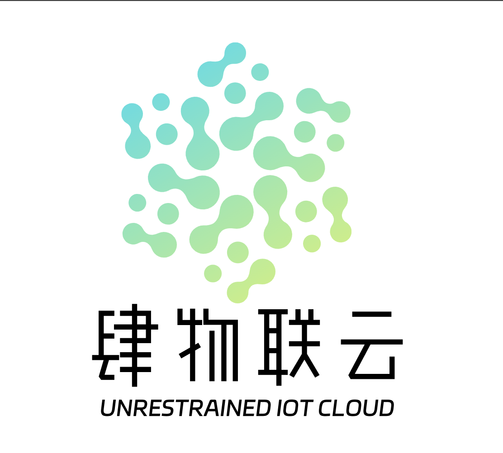

<h1 align="center" style="margin: 30px 0 30px; font-weight: bold;">Siwu-IoT-Views v3.8.8</h1>
<h4 align="center">基于RuoYi-Vue 3.8.8和Dataroom 2.0.0 集成开发的物联网可视化平台</h4>

	<a  href='https://gitee.com/jonehoo/Siwu-IoT-Views/stargazers'></img></a>
	<a  href='https://gitee.com/jonehoo/Siwu-IoT-Views/members'></img></a>
    
    

<h4 align="center"> 喜欢的话，给个 Star ⭐️ 吧！</h4>

## 🎉 特别鸣谢：
> 感谢开源项目 RuoYi-Vue 3.8.8 和 Dataroom 2.0.0 的作者们，他们为本项目提供了如此优秀的技术支持。  
> RuoYi-Vue 3.8.8 项目地址：https://gitee.com/y_project/RuoYi-Vue  
> Dataroom 2.0.0  项目地址：https://gitee.com/gcpaas/DataRoom

## ⭐️ 项目介绍

🔥 Siwu-IoT-Views 是一套基于 Spring Boot、MyBatisPlus、Element UI、G2Plot、Echarts 等技术栈的智能大屏设计工具。它提供了强大的大屏分组管理、设计、预览等功能，支持灵活的数据集接入与处理，能够帮助用户高效地构建可视化大屏应用。该项目完全开源，免费使用，适合各种 IoT 场景的展示与管理需求。

## ✨ 在线体验

> 
> 项目演示地址：https://sv.jinhuwl.top:5743  
> 扫码获取账号密码：  
>   
> ❗ 注意：演示环境为测试环境，请不要在演示环境中放入生产数据。

##  ⚡ 主要功能
* ✅ 一站式大屏解决方案，从**数据源接入**->**数据清洗处理**->**大屏设计**->**大屏预览**->**大屏发布上线** 
* ✅ 支持**多种数据集接入**，如：原始数据集、自助数据集(支持多表关联)、存储过程、JSON(静态数据)、JS脚本、Groovy脚本、ElasticSearch、HTTP接口，满足大多数数据接入需求 
* ✅ 支持大屏分组管理，便于多个大屏的统一管理和布局。
* ✅ 强大的大屏设计能力，提供简单直观的可视化界面，用户可以轻松拖拽设计组件。
* ✅ 支持多种图表组件（例如，Echarts、G2Plot）进行数据展示。

* ✅ 支持多种数据库接入，包括 MySQL、Oracle、PostgreSQL、JSON 等数据源。
* ✅ 提供 Groovy 脚本支持，用于复杂数据处理和转化，灵活应对不同的数据处理需求。

* ✅ 前端使用 Vue.js 和 Element UI，构建现代化的交互界面。
* ✅ 后端采用 Spring Boot、Spring Security、Redis 和 Jwt，提供高效、可靠的服务支持。

* ✅ 基于 Jwt 进行多终端认证，确保系统安全性。
* ✅ 支持动态权限菜单，灵活配置用户权限，满足不同角色的需求。

* ✅ 内置代码生成器，支持一键生成前后端代码，极大提高开发效率。
* ✅ 完全开源，社区贡献与代码定制化开发，易于二次开发与扩展。
##  ☝️ 技术栈
* 前端：Vue.js、Element UI、Echarts、G2Plot
* 后端：Spring Boot、Spring Security、MyBatis Plus、Redis、Jwt
* 数据库：MySQL、Oracle、PostgreSQL、JSON
* 脚本语言：Groovy

##  ‍✈️ 系统特性

| 特性                                                         | |
| --- | :-- |
| 支持大屏、设计、预览、导出图片                     | ✅        |
| 支持图层上下调整，支持置于顶层、置于底层                     | ✅    |
| 支持画布组件任意框选、组合、取消组合、锁定、批量删除、复制功能 | ✅    |
| 支持多组件框选后对齐，如：左对齐、右对齐、上对齐、下对齐、中部对齐、水平均分、垂直均分 | ✅ |
| 支持文本、超链接、时间选择器、输入框、按钮、Tab标签、图片、轮播表、播放器、排名表、翻牌器、基础表格、倒计时、系统时间、外链集成、主题切换基础组件 | ✅    |
| 支持折线图、柱状图、面积图、条形图、饼图、环图、水波图、仪表盘、进度条、词云图、雷达图、漏斗图、梯形图、中国地图、飞线图等图表组件 | ✅    |
| 支持组件库，包含系统组件、业务组件、自定义组件，在线编辑器二次开发业务或自定义图表组件 | ✅ |
| 支持图表数据定时刷新能力 | ✅ |
| 支持15种边框组件，具备动画、渐变色设置                     | ✅    |
| 支持10多种修饰组件，具备动画、渐变色设置                     | ✅    |
| 支持资源库，包含LOGO、3D图标、2D图标、修饰条、背景图等上百个大屏设计资源，资源支持自定义上传 | ✅    |
| 支持多种数据源，目前支持MySQL、PostgreSQL、Oracle、ClickHouse数据库 | ✅    |
| 支持多种数据集，目前支持原始数据集、自助数据集(支持多表关联)、存储过程数据集、JSON数据集(静态数据)、JS数据集、Groovy脚本数据集、ElasticSearch数据集、HTTP数据集，接入不同数据来源 | ✅    |
| 支持自定义接口权限、数据权限，可对接项目已有权限管理完成对大屏的安全管控 | ✅    |
| 支持大屏分组管理，支持大屏分组下的大屏管理                     | ✅    |

 

## ☘️ 演示图

---

<table>
    <tr>
        <td>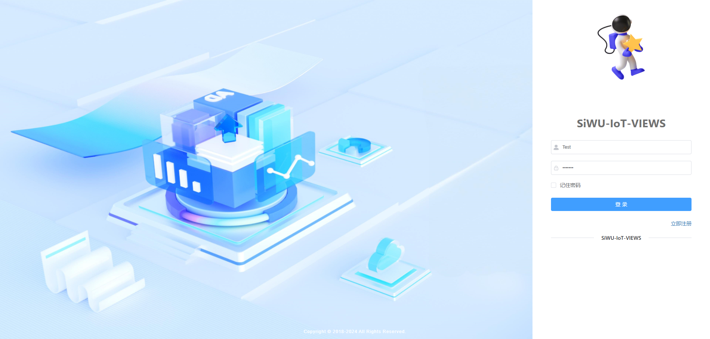</td>
        <td>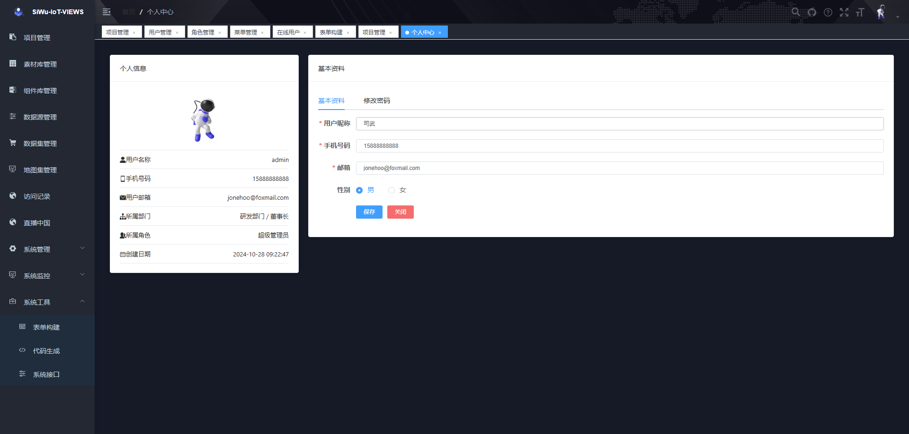</td>
    </tr>
    <tr>
        <td>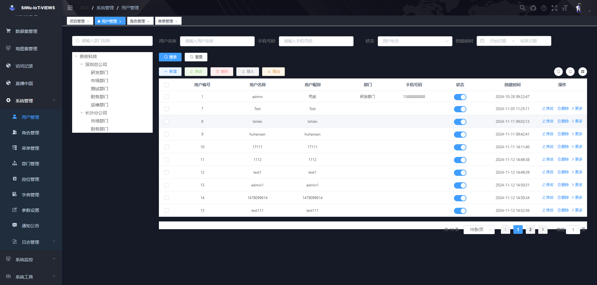</td>
        <td>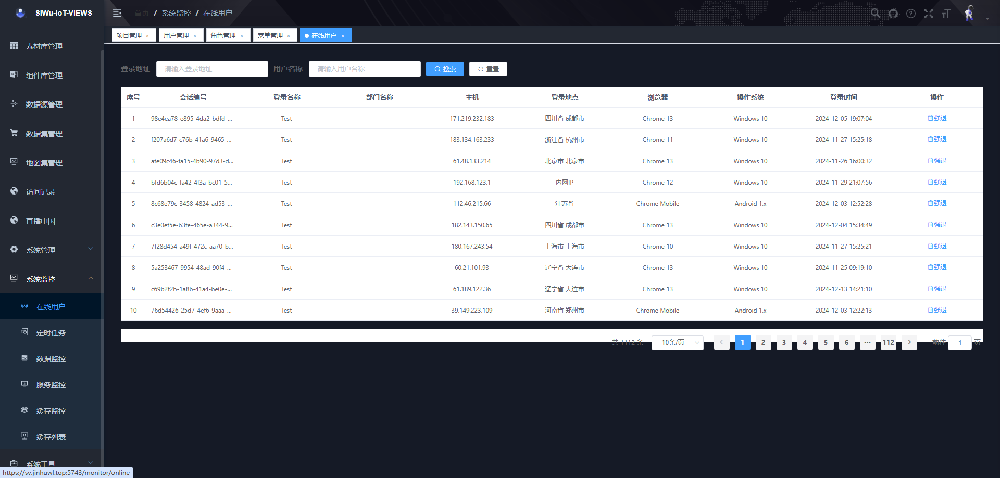</td>
    </tr>
    <tr>
        <td>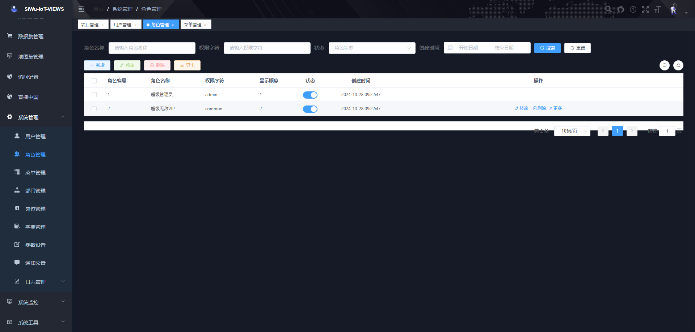</td>
        <td>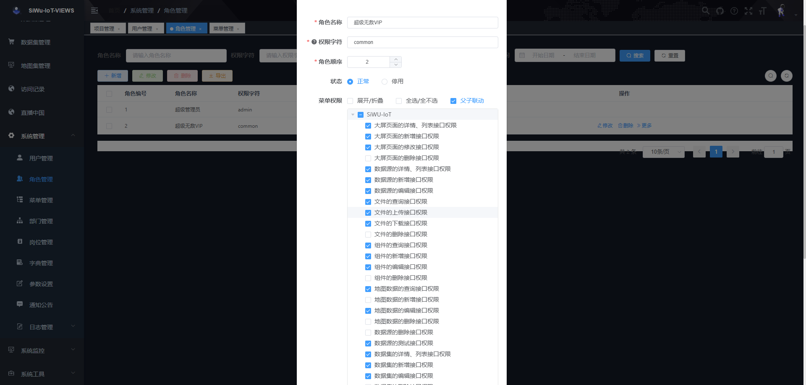</td>
    </tr>
	<tr>
        <td>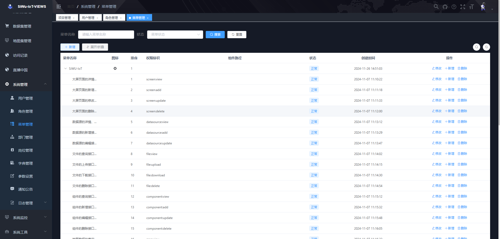</td>
        <td>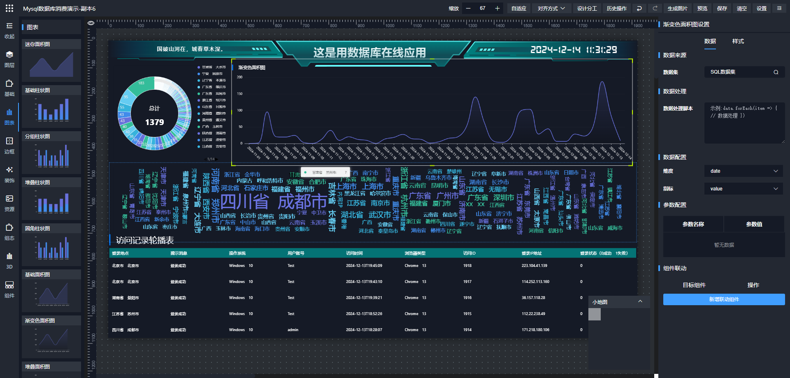</td>
    </tr>	 
    <tr>
        <td>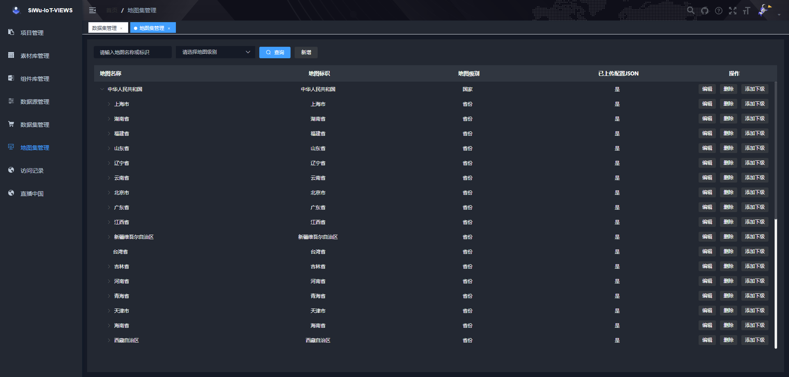</td>
        <td>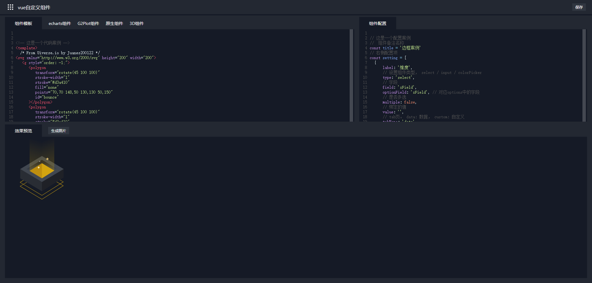</td>
    </tr>
	<tr>
        <td>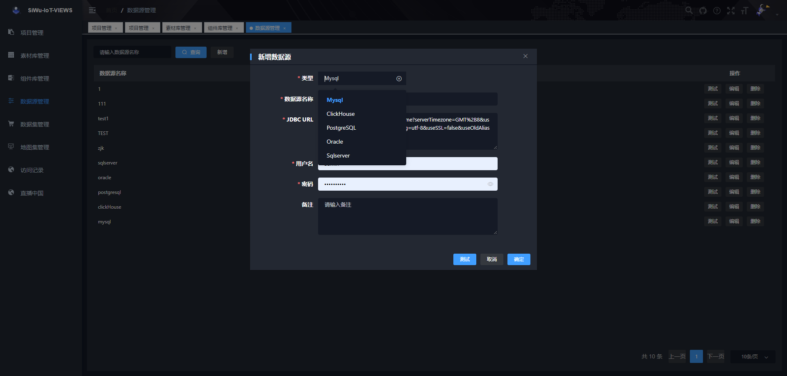</td>
        <td>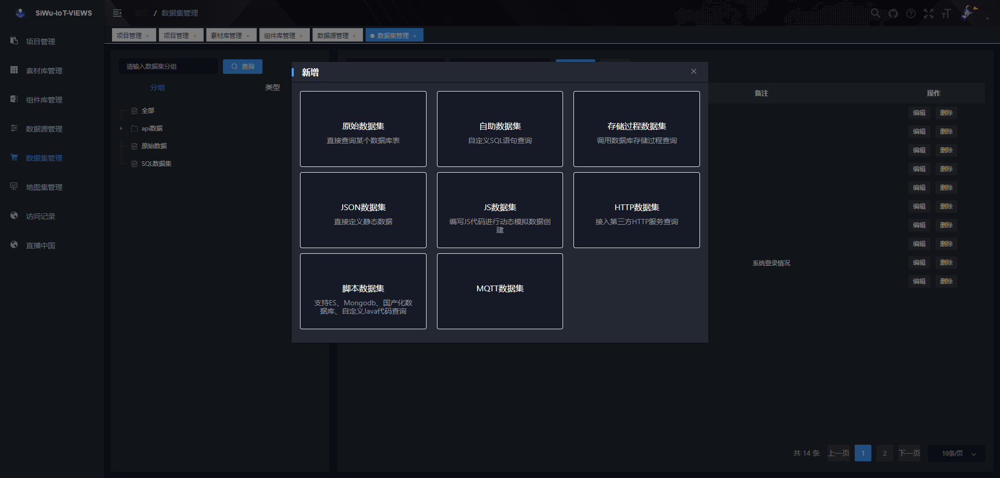</td>
    </tr>
	<tr>
        <td>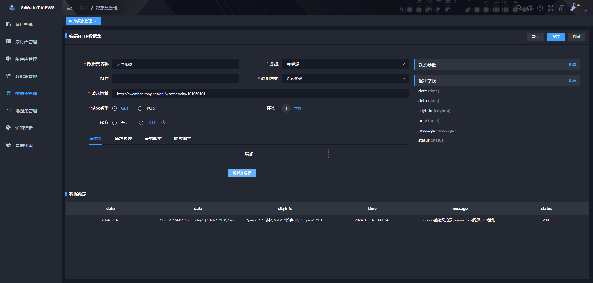</td>
        <td>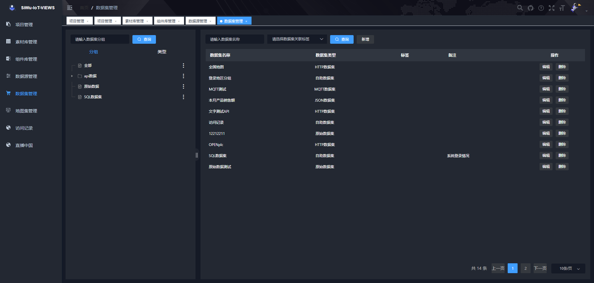</td>
    </tr>
    <tr>
        <td>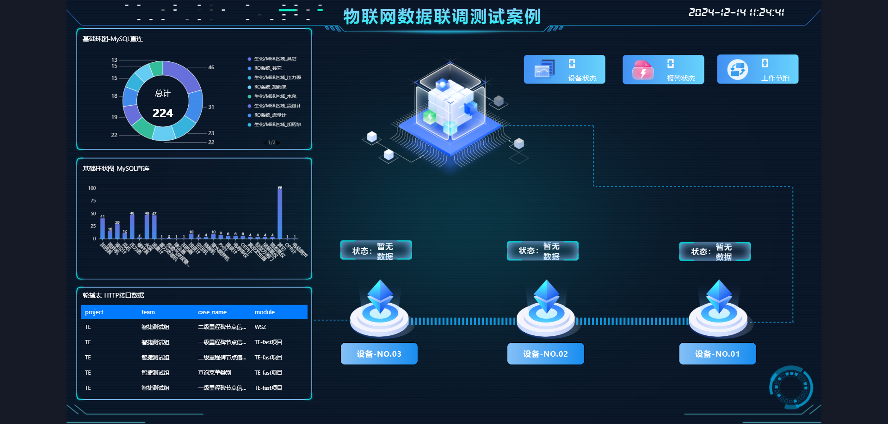</td>
        <td></td>
    </tr>
</table>

## ⛳️ 捐赠支持

